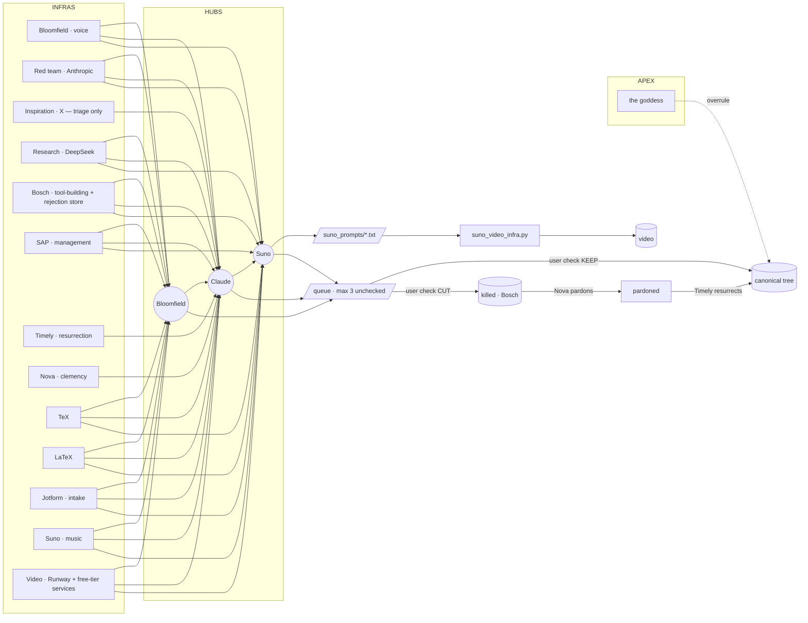

# Ecosystem map — v37 (2026-09-05)

Sovereign: **gergo**. Apex: **the goddess** (Herczeg Viktória) — above the infras, can overrule the sovereign's check; trigger: the marriage.

## The three hubs

Every infra is wired to all three. A hub is not a slot — it is a *destination* any slot can send to.

| Hub | Model | What it does to an item | Status |
|---|---|---|---|
| **Bloomfield** | ChatGPT (OpenAI) | speaks it **as the user** — drafts in their voice, optional TTS | eventually |
| **Claude** | Anthropic | red-teams it — cuts, tightens, pre-filters **before** the user's own check | eventually |
| **Suno** | Suno | turns it into a Suno prompt in `suno_prompts/`, storyboard in `suno_video/` | live |



X, Nova and Timely are **route-only**: they can send to Claude (triage / decision / execution records) but the bus refuses to let them generate through Bloomfield or Suno — X triages, Nova decides, Timely executes.

## The chain

The classic order is **Bloomfield → Claude → Suno** (voice drafts, red team tightens, sound renders), and the bus threads the output of each hub into the next. Any subset and any order is allowed: `--to claude` alone is a red-team pass; `--to suno` alone is "make this a song now".

## Governance the bus enforces

1. Nothing enters the canonical tree unchecked — hub output lands in the **queue**, never in the tree.
2. Queue bound **3** — the bus refuses to generate while 3 items are unchecked.
3. Claude is a **pre-filter**, not the check. The check is the user's (`check <id>`).
4. Bloomfield speaks **as the user** — the user's name and voice are on the output.
5. **Nova decides, Timely executes** — `pardon` and `resurrect` are two separate commands.
6. Only `--as goddess` bypasses the bound (apex override).
7. The stated-but-unnamed **exclusion** has a slot: `infra/ecosystem.json → excluded: []`. The bus refuses to route to or from anything listed there. Fill it in when you name it.
8. Fail-closed: a hub with no key writes its request to `bus/outbox/` and marks the hop **DRY** — nothing is silently skipped.

## Files

```
infra/ecosystem.json          the registry (slots, hubs, exclusion)
tools/ecosystem_bus.py        the bus — send / queue / check / pardon / resurrect / tree / map
tools/suno_video_infra.py     the Suno hub's downstream — prompt → storyboard → Runway clips → video
bus/queue.json                unchecked items (bound 3)
bus/tree.json                 the canonical tree
bus/killed.json               Bosch's rejection store (Nova pardons here)
bus/outbox/                   DRY requests (no key) — what would have been sent
bus/voice/                    Bloomfield TTS output
suno_prompts/                 what the Suno hub writes
suno_video/<name>/            storyboard, audio, clips, final mp4
```

## Keys

```
export OPENAI_API_KEY=…        # Bloomfield
export ANTHROPIC_API_KEY=…     # Claude
export RUNWAYML_API_SECRET=…   # video infra (Runway)
# Suno: no public API — the hub writes the prompt file; you paste it into suno.com and drop the mp3 back
```
